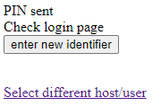

# 2D_2FA_project

## User Guide

### Starting the programs

The first step is to get the services running. This differs slightly depending on whether you are running the programs in Linux or Windows

#### Linux

To start up the server-side code, go to the **/src** folder in a terminal window and start up the server-side program **server.py** by entering:

    python3 server.py <host> <port>

...where `<host>` is the address for the server and `<port>` is the port used. For the purposes of local testing, we can use **localhost** for the host and **65432** for the port:

	python3 server.py localhost 65432

If you want to listen to any communication on that port, instead of only local communication, you can set the host to an empty string, `""`:

	python3 server.py "" 65432

Next, we will need a "device" to communicate with the server-side code. To start up a device, create a new terminal window, navigate to the **/src** folder, and enter:

	python3 device.py

#### Windows

To run on Windows, you will have to have Python 3 installed on the system; an installer can be found on the [Python website](https://www.python.org/downloads/).

First, you need to start up the server-side code. Since this requires command-line arguments, the simplest way to do this in Windows is to create a shortcut. Right-click **server.py** and select **Create Shortcut**. Then find the newly created shortcut (probably named **server.py - Shortcut**), right-click, and select **Properties**.

In Properties, go to the **Target** field. This should show `"<path>\server.py"`, where `<path>` is the file path to the server. We want to modify this by appending the host and port after the final quotation mark:

	"<path>\server.py" <host> <port>

...where `<host>` is the address for the server and `<port>` is the port used. For the purposes of local testing, we can use **localhost** for the host and **65432** for the port:

	"<path>\server.py" localhost 65432

If you want to listen to any communication on that port, instead of only local communication, you can set the host to an empty string, `""`:

	"<path>\server.py" "" 65432

When done, the Target field should look something like this:

Now, you can start up the server by double-clicking the shortcut.

Next, we will need a "device" to communicate with the server-side code. This is much simpler; to start up a device, simply double-click **device.py**.

### Starting up the interfaces

Now that both services are running, we need a way of interacting with them. In a full deployment version, a user would interact with the device through a custom UI, while a server would likely communicate with the server-side code through sockets. For the purposes of this demo, we have created a simple HTML interface for both, so a user can see how the process works.

You will need two browser windows: one for the server interface, and one for the trusted-device interface.

For the server interface, enter the address `<host>:<port>/index` where `<host>` and `<port>` correspond to the address and port of the server-side code. Currently the server is set to run on port 5001, so you should enter:

	localhost:5001/index

For the device interface, the address has the same format, but you will use the host and port of the device. Currently, the device is set to run on port 5000, so you should enter:

	localhost:5000/index

### Using the server-side element

On the server's page, you will see a prompt to input a user name.

On this page, we simulate the communications a server would do when trying to authenticate a user. To do this, the server would check on a username (simulated here by the user typing in a user name and hitting "submit"), and the 2D 2FA code gives a response that provides the current identifier for that user, and whether they are currently authorized or not. If this is the first (recent) call on that user name, then the reply will be unauthorized, which in the HTML demonstration looks like this:

If the user has been authorized, then the reply will instead show so, like this:

In a production system, this would be the signal to the server that the user is authenticated and should be logged in.

### Using the trusted-device code

On the device page, you will first see a page that lets you select the host you are attempting to authenticate on and the username used there. To do so, we have a simple HTML interface with a drop-down menu that lets you choose front a list of entries, with each line giving the name of the host and the username used there:

After selecting a name and hitting select, you will be prompted to enter an identifier for the user.

This identifier is gotten from the server when trying to login (see the previous section for how to get an identifier). Input it into the field as shown above and click "submit" to proceed, or click "select different host/user" to change the server and username.

After submitting an ID, you will be met with the folowing screen:

In a final production version, this screen could also show whether the authentication was successful or not (this information *is* currently sent in a reply from the server), but the simple HTML demo doesn't currently have the possibility, instead prompting the user to check on the server to see if they have been authenticated (see previous section). There is also a button ("enter new identifier") in order to try a new identifier with the same host/username, and a link to change host and username.